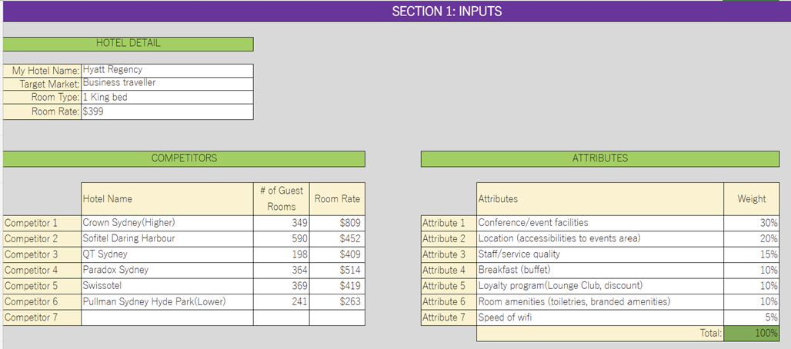
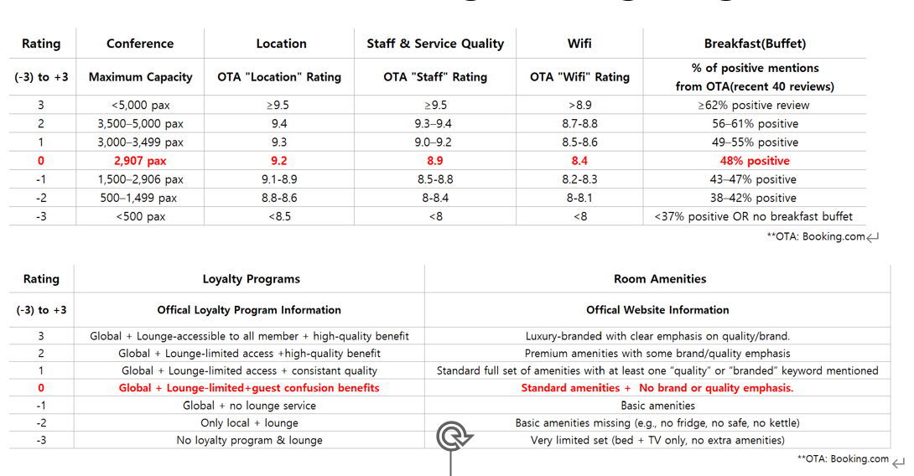
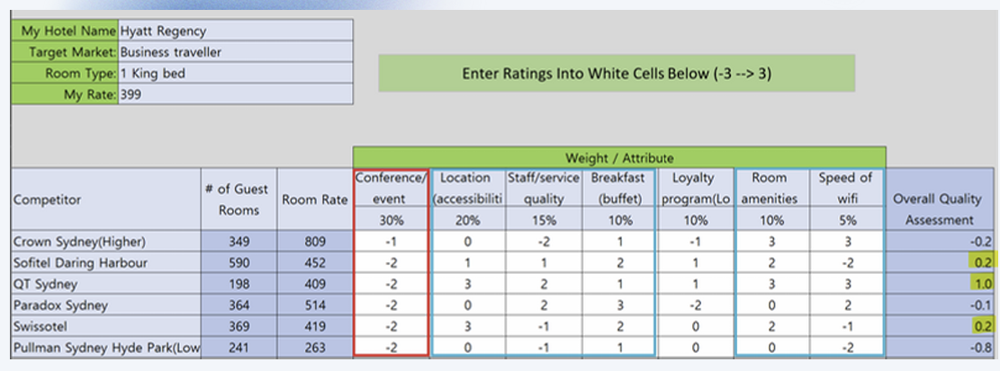
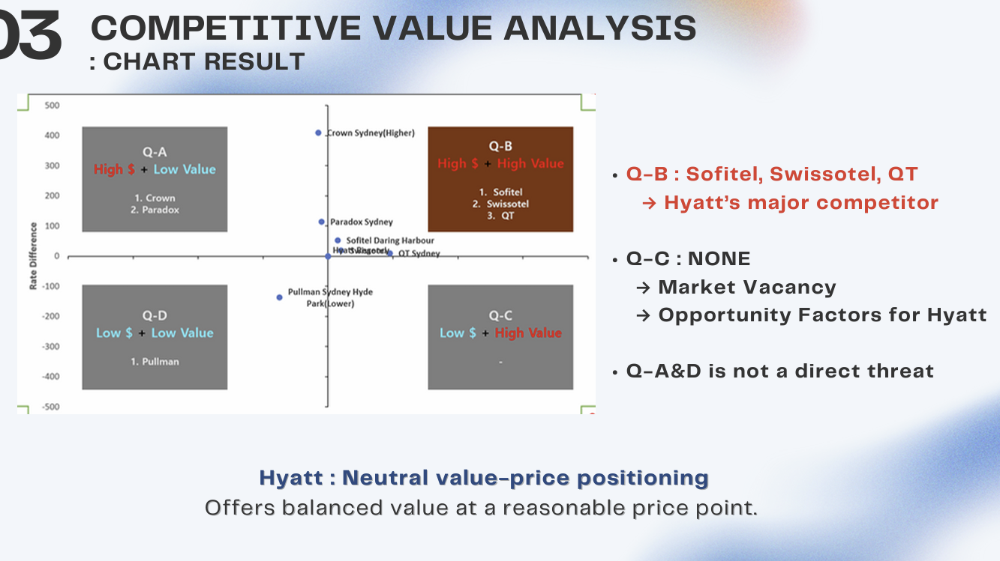
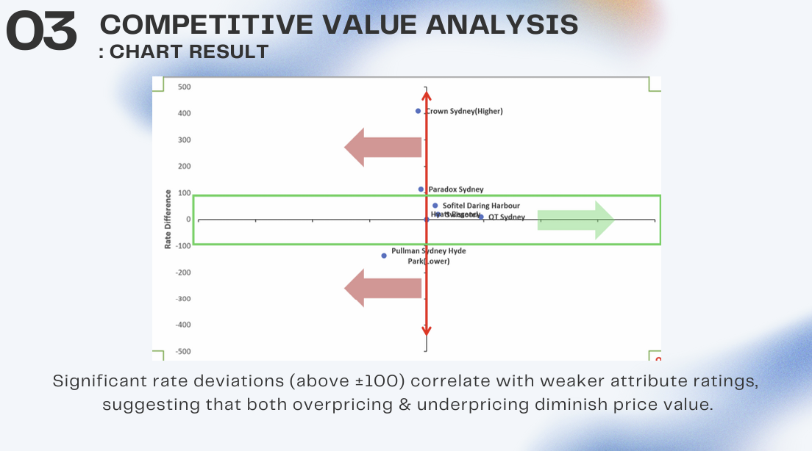
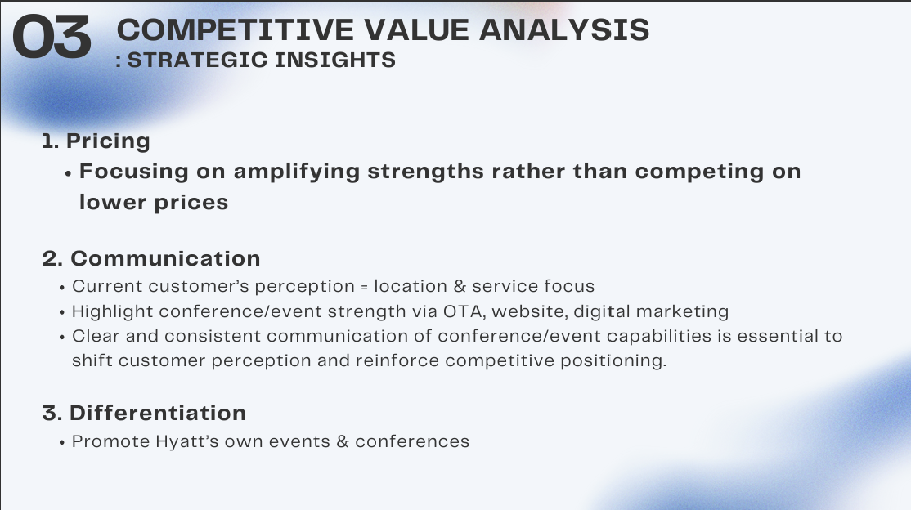
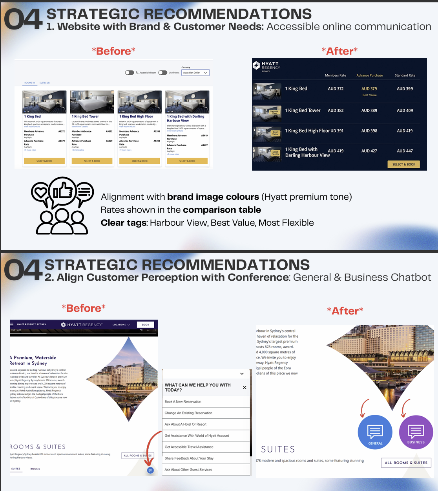
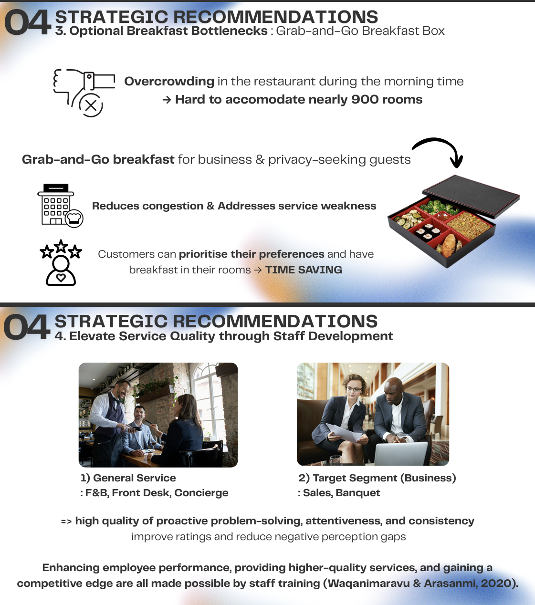
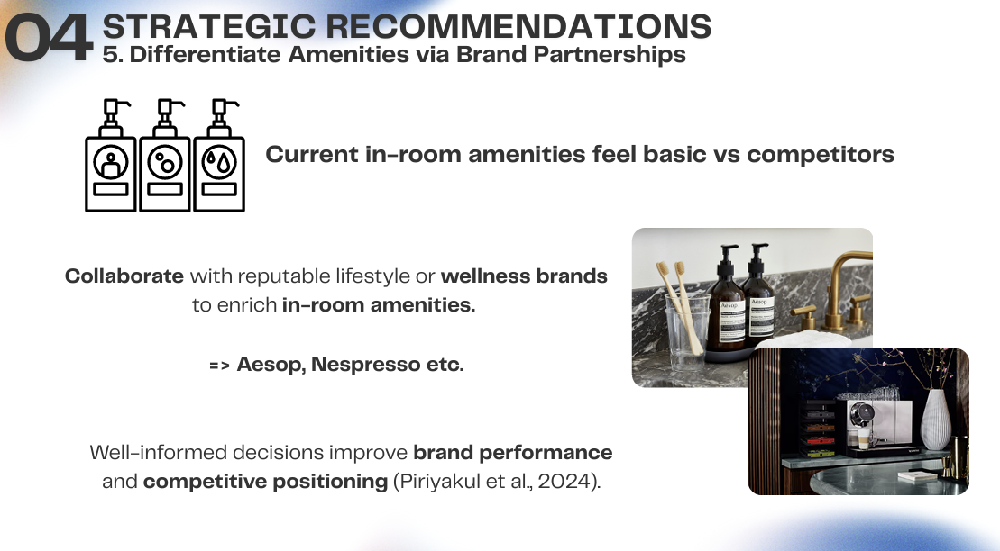

# Competitive Value Analysis – Hyatt Regency Sydney

## 1. Introduction: Hotel & Target Market
- **Hotel:** Hyatt Regency Sydney  
- **Target Segment:** Business travelers  
- **Attributes & Weighting:** Conference and event facilities (30%) carry the most weight because business travelers prioritize meeting and event spaces.  
- **Room Rates:** BAR rates for the same basic room type were recorded on the same date for comparability.  

---

## 2. Attribute-Based Rating & Weighting
- Based on objective data (capacity, reviews, amenities, price), seven criteria were evaluated.  
- Hyatt performs strongly in **conference/event capacity** but lags in service quality, breakfast, and amenities → creating perception gaps.  

  

---

## 3. Overall Assessment – Price vs. Value Positioning
- **Quadrant B (High $ + High Value):** Sofitel, Swissotel, QT → Hyatt’s main competitors.  
- **Quadrant C (Low $ + High Value):** None → Market vacancy → Opportunity for Hyatt.  
- **Quadrant A & D:** Not a direct threat.  

Conclusion: Hyatt = *Neutral value-price positioning*, but risks being overshadowed by competitors in Quadrant B.  

  

---

## 4. Strategic Insights
### 1. Pricing
- Amplify strengths rather than compete on lower prices.  
- Leverage Hyatt’s large-scale **conference/event capacity** to justify premium positioning.  

### 2. Communication
- Current perception = service & location focus.  
- Hyatt must strengthen **online messaging (OTA, website, digital marketing)** to emphasize conference/event capabilities.  

### 3. Differentiation
- Promote Hyatt’s **own events & conferences**.  
- Occupy Quadrant C by balancing **cost-effectiveness + business expertise**.  

---

## 5. Strategic Recommendations
1. **Customer Online Communication**  
   - Event/conference differentiation marketing.  
   - Clear communication of strengths on website/OTA.  
   

2. **Breakfast Bottlenecks**  
   - Introduce *Grab-and-Go Breakfast Box* to ease overcrowding.  
   

3. **Service Quality**  
   - Staff development and training in F&B, Front Desk, Banquet.  
   

4. **Amenities Differentiation**  
   - Collaborate with brands (Aesop, Nespresso) to upgrade in-room experience.  
   

---

## 6. Implications for Hyatt
- Adopt **value-enhancing strategy**, not price cuts.  
- Clear & consistent **communication of conference/event strengths** is essential to reposition Hyatt competitively.  

---

📌 *Prepared by: Group Project – Competitive Value Analysis for Hyatt Regency Sydney*
